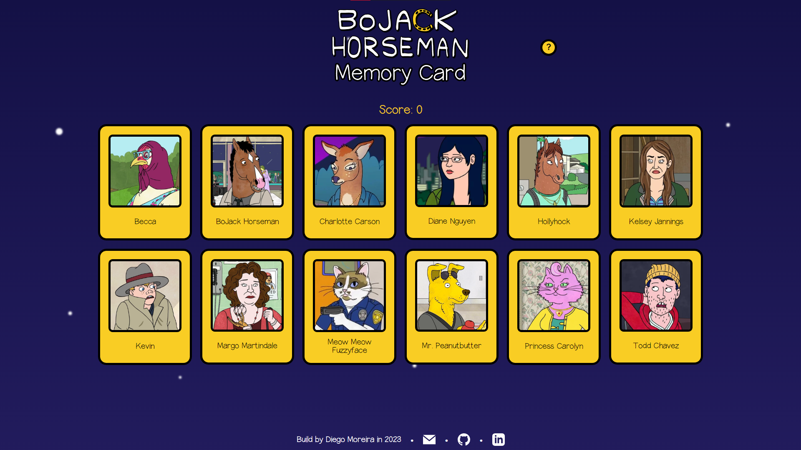

# BoJack Horseman Memory Card Game
This project was proposed as part of the curriculum of [The Odin Project](https://www.theodinproject.com/) to practice React Hooks.
It is inspired by the Bojack Horseman TV show. 

## How to play
Go to [diego-moreira8.github.io/odin-memory-card](https://diego-moreira8.github.io/odin-memory-card/). To win the game you must click on each character only once! The game ends when you've clicked on all of the 12 characters. If you click on a character more than once, you lose and the score resets.

## Credits

### Bojack Logo:

[wikimedia.org](https://commons.wikimedia.org/wiki/File:BoJack_Horseman_Logo.svg)

### Ness Font:

BYTHEBUTTERFLY
- Download link: [dafont.com](https://www.dafont.com/ness.font)
- [bythebutterfly@gmail.com](bythebutterfly@gmail.com)
- [bythebutterfly.com](http://bythebutterfly.com)